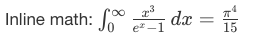

# markdown-math package

It adds math syntax support to markdown editor and preview.

## Install

```
ipm install markdown-math
```

## Usage

### LaTeX syntax

You can write equations in LaTeX syntax like this:

    ```math
    \int_0^\infty \frac{x^3}{e^x-1}\,dx = \frac{\pi^4}{15}
    ```
    
or

    $$$
    \int_0^\infty \frac{x^3}{e^x-1}\,dx = \frac{\pi^4}{15}
    $$$

It will be rendered as:


Inline example:

    Inline math: $\int_0^\infty \frac{x^3}{e^x-1}\,dx = \frac{\pi^4}{15}$

It will produce:


