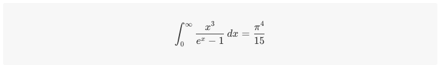

# Math for Inkdrop

Write equations in LaTeX and have them typeset with [KaTeX](https://katex.org/).



This repository holds two things: the Inkdrop plugin, and the host-agnostic rendering
package it is built on.

| Package                              | Published as                                        | What it is                                                                                                 |
| ------------------------------------ | --------------------------------------------------- | ---------------------------------------------------------------------------------------------------------- |
| [`packages/plugin`](packages/plugin) | `math` (ipm)                                        | The Inkdrop plugin — registers the `math` / `inline_math` code components and ships the Inkdrop stylesheet |
| [`packages/math`](packages/math)     | [`@inkdropapp/math`](packages/math/README.md) (npm) | The renderer — a React component plus the scoped KaTeX stylesheet, importing no Inkdrop API                |

The split exists because the renderer is useful outside the desktop app — the website demo
uses it too. Everything host-specific arrives as a prop, so one implementation serves both.

## Using the plugin

```shell
ipm install math
```

See [the plugin README](packages/plugin/README.md) for the syntax it supports, or
[the Inkdrop docs](https://docs.inkdrop.app/manual/extend-inkdrop-with-plugins) for how
plugins are installed.

## Using the renderer elsewhere

```shell
npm install @inkdropapp/math katex
```

See [the package README](packages/math/README.md) for the API, the required stylesheet,
and the peer dependencies.

## Development

Requires [pnpm](https://pnpm.io/).

```shell
pnpm install
pnpm build          # builds both packages, in dependency order
pnpm dev            # watch mode
pnpm typecheck
pnpm lint
pnpm format
```

`lint` and `format` are configured once at the root ([oxlint](https://oxc.rs/) and
[oxfmt](https://oxc.rs/)) and cover both packages.

To develop against a live Inkdrop, build and symlink the plugin directory:

```shell
pnpm build
ipm link packages/plugin
```

### A couple of things worth knowing

- The plugin **bundles** `@inkdropapp/math` rather than depending on it at runtime. The
  published plugin has to be self-contained: ipm installs it from the registry and its
  tarball excludes `node_modules`.
- Both stylesheets are **generated** at build time from `node_modules/katex` and are
  gitignored. They share one transform (`packages/math/scripts/katex-css.mjs`) and differ
  only in where the fonts live: `packages/math/styles/` carries its own WOFF2 files and
  points at them relatively, while `packages/plugin/styles/katex.css` uses absolute
  `inkdrop://math/node_modules/katex/dist/fonts/…` URLs, because Inkdrop injects a plugin's
  stylesheet as text — a relative `url()` there would resolve against the document.
- That URL scheme is why `katex` stays an unbundled runtime **dependency** of the plugin:
  ipm has to install it into the directory those URLs point at.

## Publishing

Two independent artifacts, and order matters — publish the renderer first if a plugin
release depends on renderer changes, since the plugin bundles it at build time.

```shell
pnpm --filter @inkdropapp/math publish   # npm
ipm publish packages/plugin              # Inkdrop plugin registry
```

## License

MIT
